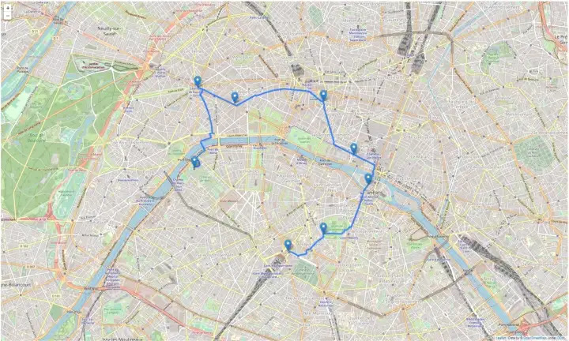
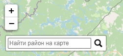
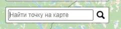

## `imba` - утилита, с помощью которой, происходит генерация карты и декоративных элементов

основные зависимости:

```python
folium==0.13.0
openpyxl==3.0.10
pandas==1.5.1
requests==2.28.1
```

```python
import folium, geopandas, branca, base64, os
import osmnx as ox
import networkx as nx
from folium.plugins import Search
from folium import IFrame

def create_html():
    # БД районов
    states = geopandas.read_file(
        "data/area.json",
        driver="GeoJSON",
    )
    # БД меток
    cities = geopandas.read_file(
        "data/points.json",
        driver="GeoJSON",
    )
    # Сортировка данных по количеству населения
    states_sorted = states.sort_values(by="density", ascending=False)

    states_sorted.head(5).append(states_sorted.tail(5))[["name", "density"]]

    def rd2(x):
        return round(x, 2)


    minimum, maximum = states["density"].quantile([0.05, 0.95]).apply(rd2)

    mean = round(states["density"].mean(), 2)


    print(f"minimum: {minimum}", f"maximum: {maximum}", f"Mean: {mean}", sep="\n\n")


    # цветовая схема для фильтра населенности районов
    colormap = branca.colormap.LinearColormap(
        colors=["#f2f0f7", "#DEFFDE", "#B8FFB8", "#68FF68", "#00FF00"],
        index=states["density"].quantile([0.2, 0.4, 0.6, 0.8]),
        vmin=minimum,
        vmax=maximum,
    )
    # наименование графика
    colormap.caption = "Плотность населения"

    cities = geopandas.sjoin(cities, states, how="inner", predicate="within")
    pop_ranked_cities = cities.sort_values(by="pop_max", ascending=False)[
        ["nameascii", "pop_max", "geometry"]
    ].iloc[:20]
    print(pop_ranked_cities)
    # pop_ranked_cities.head(5)

    # Создание карты со стратовой точкой и масштабом
    m = folium.Map(location=[56, 37], zoom_start=8)


    """ МАРШРУТЫ """

    # route_marker = './images/marker.png' - добавление кастомного марекра
    # icons_size = (20,20) # размер иконок
    # html = ''.format - добавление картинок

    # Чтение координат маршрутов
    routesData = os.path.join('data/routes.json')


    folium.GeoJson(routesData, name='Маршрут').add_to(m)

    def style_function(x):
        return {
            "fillColor": colormap(x["properties"]["density"]),
            "color": "black",
            "weight": 2,
            "fillOpacity": 0.5,
        }

    stategeo = folium.GeoJson(
        states,
        name="Районы",
        style_function=style_function,
        tooltip=folium.GeoJsonTooltip(
            fields=["name", "density"], aliases=["", "Плотность населения"], localize=True
        ),
    ).add_to(m)

    citygeo = folium.GeoJson(
        pop_ranked_cities,
        name="Метки",
        tooltip=folium.GeoJsonTooltip(
            fields=["nameascii", "pop_max"], aliases=["Дом", "Популяция"], localize=True
        ),
    ).add_to(m)

    statesearch = Search(
        layer=stategeo,
        geom_type="Polygon",
        placeholder="Найти район на карте",
        collapsed=False,
        search_label="name",
        weight=3,
    ).add_to(m)

    citysearch = Search(
        layer=citygeo,
        geom_type="Point",
        placeholder="Найти точку на карте",
        collapsed=True,
        search_label="nameascii",
    ).add_to(m)

    # Добавление слоев и цветовых схем на карту
    folium.LayerControl().add_to(m)
    colormap.add_to(m)

    # сохранение карты
    m.save("imba.html")
```

## генерация маршрутов

INPUT:

```python
routesData = os.path.join('data/routes.json')
folium.GeoJson(routesData, name='Маршрут').add_to(m)
```

`data/routes.json` - файл с координатами маршрутов

```json
{
  "type": "FeatureCollection",
  "features": [
    {
      "type": "Feature",
      "properties": {},
      "geometry": { "type": "LineString", "coordinates": [
        [37.03, 56.0],
        [37.03, 55.985],
        [37.03, 55.935],
        [37.03, 55.925],
        [37.03, 55.915],
        [37.03, 55.443],
      ] }
    }
  ]
}
```

OUTPUT:



## Поиск районов и адресов

```python
# Районы
stategeo = folium.GeoJson(
    states,
    name="Районы",
    style_function=style_function,
    tooltip=folium.GeoJsonTooltip(
        fields=["name", "density"], aliases=["", "Плотность населения"], localize=True
    ),
).add_to(m)

# метки
citygeo = folium.GeoJson(
    pop_ranked_cities,
    name="Метки",
    tooltip=folium.GeoJsonTooltip(
        fields=["nameascii", "pop_max"], aliases=["Дом", "Популяция"], localize=True
    ),
).add_to(m)
```

### Поле поиска районов

```python
# поле поиска районов
statesearch = Search(
    layer=stategeo,
    geom_type="Polygon",
    placeholder="Найти район на карте",
    collapsed=False,
    search_label="name",
    weight=3,
).add_to(m)
```



### Поле поиска адресов

```python
# поле поиска адресов
citysearch = Search(
    layer=citygeo,
    geom_type="Point",
    placeholder="Найти точку на карте",
    collapsed=True,
    search_label="nameascii",
).add_to(m)
```


