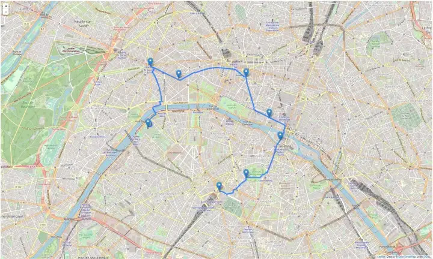

`map_lib` - библиотека, для генерации карты

`map_area.gen_json_area()` - генерирует области (районы) на карте

Пример:

INPUT:

```python
# input:

# map_area.gen_json_area("id", "name", density, coordinates[[[int, int]]])

map_area.gen_json_area(["25", "Район", 2477,[[
            [
              [37.03, 56.0],
              [37.03, 55.985],
              [37.0, 55.985],
              [37.0, 56.0]
            ]
          ]]])

,
```

```json
// OUTPUT:
{
      "type": "Feature",
      "id": "25",
      "properties": { "name": "Район", "density": 2477 },
      "geometry": {
        "type": "MultiPolygon",
        "coordinates": [
          [
            [
              [37.03, 56.0],
              [37.03, 55.985],
              [37.0, 55.985],
              [37.0, 56.0]
            ]
          ]
        ]
      }
    }
```

`map_area.gen_json_point()` - генерирует метки на карте

INPUT:

```python
map_area.gen_json_point("Черемушки", 0, 1000 [37.03, 56.0])
```

OUTPUT:
```json
{
      "type": "Feature",
      "properties": {
        "nameascii": "Черемушки",
        "pop_max": 0,
        "pop_min": 1000
      },
      "geometry": {
        "type": "Point",
        "coordinates": [37.03, 56.0]
        }
    }
```


`map_area.gen_json_routes([[[],]])` - генерирует маршруты на карте

INPUT:

```python
map_area.gen_json_routes([[
            [37.03, 56.0],
            [37.03, 55.985],
            [37.0, 55.985],
            [37.0, 56.0]
    ]])
```

OUTPUT:

```json
{
  "type": "FeatureCollection",
  "features": [
    {
      "type": "Feature",
      "properties": {},
      "geometry": { "type": "LineString", "coordinates": [
            [37.03, 56.0],
            [37.03, 55.985],
            [37.0, 55.985],
            [37.0, 56.0]
      ] }
    }
  ]
}

```

